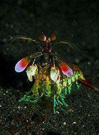
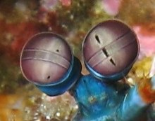

# Mantis Shrimp

An Absolute Beast

## Background

A front facing mantis shrimp

Mantis shrimps, or stomatopods, are marine crustaceans of the order Stomatopoda. Some species have specialised calcified "clubs" that can strike with great power, while others have sharp forelimbs used to capture prey. They branched from other members of the class Malacostraca around 340 million years ago. Mantis shrimps typically grow to around 10 cm (3.9 in) in length. A few can reach up to 38 cm (15 in). The largest mantis shrimp ever caught had a length of 46 cm (18 in); it was caught in the Indian River near Fort Pierce, Florida, in the United States.

A mantis shrimp's carapace (the bony, thick shell that covers crustaceans and some other species) covers only the rear part of the head and the first four segments of the thorax. Varieties range in color from shades of brown to vivid colors, with more than 450 species of mantis shrimps being known. They are among the most important predators in many shallow, tropical and subtropical marine habitats. However, despite being common, they are poorly understood, as many species spend most of their lives tucked away in burrows and holes.

Called "sea locusts" by ancient Assyrians, "prawn killers" in Australia,[and now sometimes referred to as "thumb splitters"—because of the animal's ability to inflict painful gashes if handled incautiously—mantis shrimps have powerful claws that are used to attack and kill prey by spearing, stunning, or dismembering.

## Claws

A close up of mantis shrimp eyes

The mantis shrimp's second pair of thoracic appendages has been adapted for powerful close-range combat with high modifications. The appendage differences divide mantis shrimp into two main types: those that hunt by impaling their prey with spear-like structures and those that smash prey with a powerful blow from a heavily mineralised club-like appendage. A considerable amount of damage can be inflicted after impact with these robust, hammer-like claws. This club is further divided into three subregions: the impact region, the periodic region, and the striated region. Mantis shrimp are commonly separated into two distinct groups determined by the type of claws they possess.

Smashers possess a much more developed club and a more rudimentary spear (which is nevertheless quite sharp and still used in fights between their own kind); the club is used to bludgeon and smash their meals apart. The inner aspect of the terminal portion of the appendage can also possess a sharp edge, used to cut prey while the mantis shrimp swims. Spearers are armed with spiny appendages topped with barbed tips, used to stab and snag prey.

Both types strike by rapidly unfolding and swinging their raptorial claws at the prey, and can inflict serious damage on victims significantly greater in size than themselves. In smashers, these two weapons are employed with blinding quickness, with an acceleration of 10,400 g (102,000 m/s2 or 335,000 ft/s2) and speeds of 23 m/s (83 km/h; 51 mph) from a standing start. Because they strike so rapidly, they generate vapor-filled bubbles in the water between the appendage and the striking surface—known as cavitation bubbles. The collapse of these cavitation bubbles produces measurable forces on their prey in addition to the instantaneous forces of 1,500 newtons that are caused by the impact of the appendage against the striking surface, which means that the prey is hit twice by a single strike; first by the claw and then by the collapsing cavitation bubbles that immediately follow. Even if the initial strike misses the prey, the resulting shock wave can be enough to stun or kill.

The impact can also produce sonoluminescence from the collapsing bubble. This will produce a very small amount of light within the collapsing bubble, although the light is too weak and short-lived to be detected without advanced scientific equipment. The light emission probably has no biological significance, but is rather a side effect of the rapid snapping motion. Pistol shrimp produce this effect in a very similar manner.

Smashers use this ability to attack snails, crabs, molluscs, and rock oysters, their blunt clubs enabling them to crack the shells of their prey into pieces. Spearers, however, prefer the meat of softer animals, such as fish, which their barbed claws can more easily slice and snag. The appendages are being studied as a microscale analogue for new macroscale material structures.

## Culinary Uses

In Japanese cuisine, the mantis shrimp species Oratosquilla oratoria, called shako (蝦蛄), is eaten boiled as a sushi topping, and occasionally raw as sashimi. Mantis shrimps are abundant along Vietnam's coast, known in Vietnamese as bề bề or tôm tít. In regions such as Nha Trang, they are called bàn chải, named for its resemblance to a scrub brush. The shrimp can be steamed, boiled, grilled, or dried, used with pepper, salt and lime, fish sauce and tamarind, or fennel.

In Cantonese cuisine, the mantis shrimp is known as "pissing shrimp" (Chinese: 瀨尿蝦; pinyin: lài niào xiā; Jyutping: laaih niu hā) because of their tendency to shoot a jet of water when picked up. After cooking, their flesh is closer to that of lobsters than that of shrimp, and like lobsters, their shells are quite hard and require some pressure to crack. Usually, they are deep fried with garlic and chili peppers.

In the Mediterranean countries, the mantis shrimp Squilla mantis is a common seafood, especially on the Adriatic coasts (canocchia) and the Gulf of Cádiz (galera). In the Philippines, the mantis shrimp is known as tatampal, hipong-dapa, or alupihang-dagat, and is cooked and eaten like any other shrimp. In Hawaii, some mantis shrimp have grown unusually large in the contaminated water of the Grand Ala Wai Canal in Waikiki. The dangers normally associated with consuming seafood caught in contaminated waters are present in these mantis shrimp.

## Cool Features

Lots of cool things about mantis shrimp, including:

### Eyes

*   Mounted on stalks for ocular mobility
*   Most complex in animal kingdom
*   Has 12 to 16 kinds of photoreceptors (humans have 3)
*   Can see colors in 300-720 nm wavelength range
*   Can see polarized light
*   Only animal that can see circularly polarized light
*   These adaptations allow it to compute information faster

### Other Features

*   Can be monogamous upwards of 20 years
*   Occasionally do some friendly sparring with eachother
*   Hunters, which are cooler than prey
*   Shells are studied for possible body armor applications or improvements
*   Some move around by rolling like a pill bug
*   Can grow to a foot long
*   Can shoot water at you after being picked up

## Citations

*   Joel W. Martin & George E. Davis (2001). An Updated Classification of the Recent Crustacea [Updated Classification of the Recent Crustacea](http://atiniui.nhm.org/pdfs/3839/3839.pdf)
*   James Gonser (2003). [Gonser](http://the.honoluluadvertiser.com/article/2003/Feb/14/ln/ln01a.html)
*   Milius, Susan (2012). Mantis shrimp flub color vision test. [Mantis Shrimp Color Vision](https://en.wikipedia.org/wiki/Science_News)

## Source

Wikipedia Mantis Shrimp: [Source Wikipedia Article](https://en.wikipedia.org/wiki/Mantis_shrimp) , page by Joe Madejski

