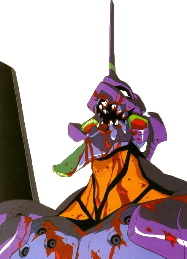
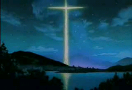
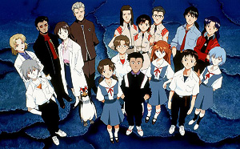

# Neon Genesis Evangelion

A story of pain, suffering and human beings turning into orange Fanta because they're all lonely
  

## About Evangelion

Evangelion Logo

Neon Genesis Evangelion (Hepburn: Shinseiki Evangerion, lit. "New Century Gospel") is a Japanese mecha anime television series produced by Gainax and Tatsunoko Production, directed by Hideaki Anno and broadcast on TV Tokyo from October 1995 to March 1996. The cast included Megumi Ogata as Shinji Ikari, Kotono Mitsuishi as Misato Katsuragi, Megumi Hayashibara as Rei Ayanami, and Yūko Miyamura as Asuka Langley Soryu. Music for the series was composed by Shirō Sagisu.  

Evangelion is set fifteen years after a worldwide cataclysm, particularly in the futuristic fortified city of Tokyo-3. The protagonist is Shinji, a teenage boy who was recruited by his father Gendo to the shadowy organization Nerv to pilot a giant bio-machine mecha called an "Evangelion" into combat with alien beings called "Angels". The series explores the experiences and emotions of Evangelion pilots and members of Nerv as they try to prevent any and all of the Angels from causing another cataclysm, and as they deal with the quest of finding out the real truth behind events and organizational moves. The series features imagery derived from Kabbalah, Christianity, and Judaism.

Neon Genesis Evangelion received critical acclaim but also garnered controversy. Particularly controversial were the last two episodes of the show, leading the team behind the series to produce the original intended version of the ending in the 1997 film The End of Evangelion. Regarded as a deconstruction of the mecha genre, the original TV series led to a rebirth of
the anime industry and has become a cultural icon. Film, manga, home video, and other products in the Evangelion franchise have achieved record sales in Japanese markets and strong sales in overseas markets, with related goods selling over ¥150 billion by 2007 and Evangelion pachinko machines selling ¥700 billion by 2015.

  

## Plot

Crosses of epic power  

2015, fifteen years after a global cataclysm known as the Second Impact, teenager Shinji Ikari is summoned to the futuristic city of Tokyo-3 by his estranged father Gendo Ikari, director of the special paramilitary force Nerv. Shinji witnesses United Nations forces battling an Angel, one of a race of giant monstrous beings whose awakening was foretold by the Dead Sea Scrolls. Because of the Angels' near-impenetrable force-fields, Nerv's giant Evangelion bio-machines, synchronized to the nervous systems of their pilots and possessing their own force-fields, are the only weapons capable of keeping the Angels from annihilating humanity. Nerv officer Misato Katsuragi escorts Shinji into the Nerv complex beneath the city, where his father pressures him into piloting the Evangelion Unit-01 against the Angel. Without training, Shinji is quickly overwhelmed in the battle, causing the Evangelion to go berserk and savagely kill the Angel on its own.

Following hospitalization, Shinji moves in with Misato and settles into life in Tokyo-3. In his second battle, Shinji destroys an Angel but runs away afterwards, distraught. Misato confronts Shinji and he decides to remain a pilot. The Nerv crew and Shinji must then battle and defeat the remaining 14 Angels in order to prevent the Third Impact, a global cataclysm that would destroy the world. Evangelion Unit-00 is repaired shortly afterwards. Shinji tries to befriend its pilot, the mysterious, socially isolated teenage girl Rei Ayanami. With Rei's help, Shinji defeats another Angel. They are then joined by the pilot of Evangelion Unit-02, the multitalented, but insufferable teenager Asuka Langley Sōryu, who is German-Japanese-American. Together, the three of them manage to defeat several Angels. As Shinji adjusts to his new role as pilot, he gradually becomes more confident and self-assured. Asuka moves in with Shinji, and they begin to develop confused feelings for one another, kissing at her provocation. 

After being absorbed by an Angel, Shinji breaks free thanks to the Eva acting on its own. He is later forced
to fight an infected Evangelion Unit-03 and watches its pilot, his friend and classmate Toji Suzuhara, incapacitated and presumably permanently disabled. Asuka loses her self-confidence following a defeat and spirals into depression. This is worsened by her next fight, against an Angel which attacks her mind and forces her to relive her worst fears and childhood trauma, resulting in a mental breakdown. In the next battle, Rei self-destructs Unit-00 and dies to save Shinji's life. Misato and Shinji visit the hospital where they find Rei alive but claiming she is "the third Rei". Misato forces scientist Ritsuko Akagi to reveal the dark secrets of Nerv, the Evangelion boneyard and the dummy plug system which operates using clones of Rei, who was herself created with the DNA of his mother, Yui Ikari. This succession of events leaves Shinji emotionally scarred and alienated from the rest of the characters. Kaworu Nagisa replaces the catatonic Asuka as pilot of Unit-02. Kaworu, who initially befriends Shinji and gains his trust, is in truth the final foretold Angel, Tabris. Kaworu fights Shinji, then realizes that he must die if humanity is to survive and asks Shinji to kill him. Shinji hesitates but eventually kills Kaworu, causing Shinji to be overriden with guilt.

## Characters

All characters after merging into Orange Fanta

Shinji Ikari is the series protagonist and the designated pilot of Evangelion Unit-01. After witnessing his mother Yui Ikari's death as a child, Shinji was abandoned by his father, Gendo Ikari. He is emotionally hypersensitive and sometimes does as expected out of fear of rejection, but he has often rebelled and refused to pilot the Eva because of the extremely excruciating harm that has been done to him or to his friends. Throughout the series, he says to himself "I mustn't run away" as a means of encouraging himself to face the threats of the day, and this sometimes actually gives him bravery in battle, but he has a lingering habit of withdrawing in response to traumatic events. Anno has described Shinji as a boy who "shrinks from human contact"
and has "convinced himself that he is a completely unnecessary person".

The withdrawn and mysterious pilot of Evangelion Unit-00, Rei Ayanami, is a clone made from the salvaged remains of Yui and is plagued by a sense of negative self-worth stemming from the realization that she is an expendable asset. She at one time despised Shinji for his lack of trust in his father Gendo, with whom Rei is very close. However, after Shinji and Rei successfully defeat the Angel Ramiel, she takes a friendly liking to him. Towards the end of the series,it is revealed that she is one of many clones, whose use is to replace the currently existing Rei if she is killed.

Asuka Langley Soryu is a child prodigy who pilots Evangelion Unit-02 and possesses a fiery temper and an overabundance of pride and self-confidence, which often gets her in trouble and difficulty, especially during battles. As a little girl, Asuka discovered the body of her mother shortly after she committed suicide, leading the child to repress her emotions and vow never to cry. Asuka and Shinji develop intense but ambiguous feelings towards each other having difficulty to reach out to others, as their relationship was initially modeled on the one between Jean, Nadia's love interest and eventual husband in the earlier Nadia. Compared to Shinji, Asuka and Rei are presented with their own flaws and difficulty relating to other people.

## Episodes

Each episode has two titles: one is the original Japanese title, and the second
is an English title that was chosen by Japanese studio Gainax itself and appears as an eye catch. Most often, the official English title is not a direct translation of the Japanese title. For example, the direct translation of the Japanese title of episode 2 is "Unfamiliar Ceilings", but the English title is "The Beast". Sometimes, however, the two titles are either similar or exactly the same, as was the case with the first episode "Angel Attack".

### Part I

1. "Angel Attack" / "Angel Attack”

2. "Unfamiliar Ceilings" / "The Beast"

3.  "The Silent Phone" / "A Transfer"

4. "Rain, After Running Away" / "Hedgehog's Dilemma"

5. "Rei, Beyond the Heart" / "Rei I”

6. "Showdown in Tokyo-3" / "Rei II"

7. "The Works of Man" / "A Human Work"

8. "Asuka Arrives in Japan" / "Asuka Strikes!"

9. "Mind, Matching, Moment" / "Both of You, Dance Like You Want to Win!"

10. "The Magma Diver" / "Magma Diver"

11. "In the Still Darkness" / "The Day Tokyo-3 Stood Still"

12. "A Miracle's Worth" / "She said, 'Don't make others suffer for your personal hatred.'"

13. "Angel Infiltration" / "Lilliputian Hitcher"

14. "Seele, the Seat of the Soul" / "Weaving a Story"

15. "Lies and Silence" / "Those women longed for the touch of others' lips, and thus invited their kisses."
  

### Part II

The 16th episode marked a distinct shift that would characterize the second half of Evangelion as being more psychological than action or adventure. This change in emphasis was partly due to the development of the story, but also partly because by this point, production had begun running out of funding and failing to meet the schedule; this collapse has been identified by at least episode director Kazuya Tsurumaki as the impetus for Evangelion's turn into internal conflict.

16. "The sickness unto death, and then…" / "Splitting of the Breast"

17. "The Fourth to be Qualified" / "Fourth Child"

18. "Life and Death Decisions" / "Ambivalence"

19. "A Man's Battle" / "Introjection"

20. "Of the Shape of Hearts and Humans" / "Weaving a Story 2: oral stage"

21. "The Birth of NERV" / "He was aware that he was still a child.”

22. "Staying Human" / "Don't Be."

24. "Tears" / "Rei III"

25. "The Last Cometh" / "The Beginning and the End, or 'Knockin' on Heaven's Door'"

26. "The Ending World" / "Do you love me?"

27. "The Beast that Shouted 'I' at the Heart of the World" / "Take care of yourself"

### Complementary Ending  

The complementary ending to Neon Genesis Evangelion is first teased in Rebirth, the second half of the theatrical film Neon Genesis Evangelion: Death & Rebirth. Rebirth comprises the first twenty-five minutes of Episode 25' and ends as the Mass Production Evangelions under the control of SEELE sortie to combat Asuka under command of NERV. The full ending, split into two 45-minute long episodes, 25' and 26', is shown in the theatrical film The End of Evangelion.
 

- 25' "Air" / "Love is Destructive"

- 26' "Sincerely Yours" / "ONE MORE FINAL: I need you."
  

## Citations

- Slater-Williams, Josh (September 18, 2013). "Scotland Loves Anime 2013: The Fourth Impact". The Skinny. Retrieved February 4, 2019. [http://www.theskinny.co.uk/festivals/uk-festivals/film/scotland-loves-anime-2013-the-fourth-impact](http://www.theskinny.co.uk/festivals/uk-festivals/film/scotland-loves-anime-2013-the-fourth-impact)

- "Neon Genesis Evangelion Platinum Complete Collection". ADV Films. Archived from the original on July 14, 2006. Retrieved June 25, 2018 [https://archive.today/20060714194953/http://www.advfilms.com/CatalogFilms_Detail.asp?ID=4313](https://archive.today/20060714194953/http://www.advfilms.com/CatalogFilms_Detail.asp?ID=4313)

- Loo, Egan (September 8, 2007). "Human-Sized Eva Spear Auctioned for 13.7 Million Yen". Anime News Network. Retrieved July 22, 2018. [http://www.animenewsnetwork.com/news/2007-09-08/human-sized-eva-spear-auctioned-for-13.7-million-yen/2](http://www.animenewsnetwork.com/news/2007-09-08/human-sized-eva-spear-auctioned-for-13.7-million-yen/2)

  

## Sources
  

- Wikipedia Neon Genesis Evangelion: [https://en.wikipedia.org/wiki/Neon_Genesis_Evangelion](https://en.wikipedia.org/wiki/Neon_Genesis_Evangelion)

- Wikipedia Evangelion Episodes: [https://en.wikipedia.org/wiki/List_of_Neon_Genesis_Evangelion_episodes](https://en.wikipedia.org/wiki/List_of_Neon_Genesis_Evangelion_episodes)

